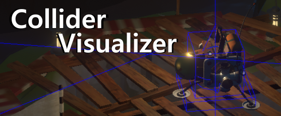

# Collider Visualizer

# 

This is a mod for Outer Wilds which allows the player to visualize diferent kinds of colliders (and Shapes) that exist in the game.

In the settings you can change the amount of colliders that the mod will render, how far they can be before it stops rendering, how much will it search for new colliders per second and which type of collider to show (bounding boxes (in red), trigger colliders (in green) and normal colliders (in blue)).
